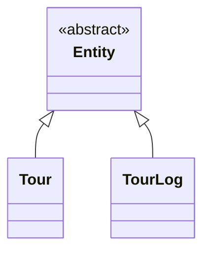
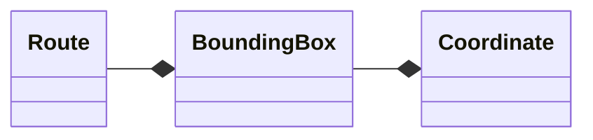
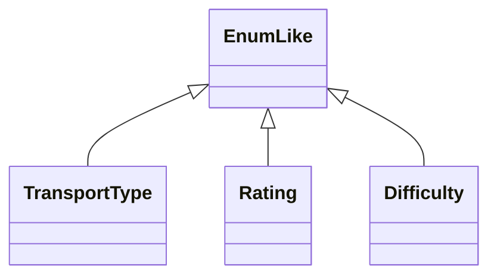
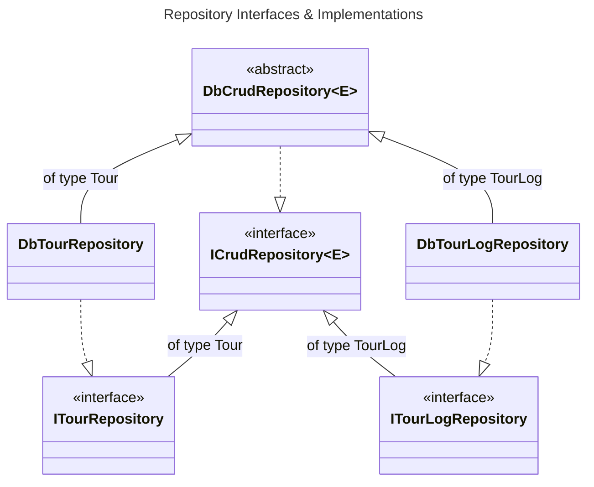

# tour-planner
C# WPF application for managing tours. Written by Nico Lerchl for Software Engineering 2 at FH Technikum Wien.

## Architecture
### Model
The model layer provides entities and models for the above layers. It is a very simple layer, only providing the bare minimum to be able to work with the data. It is also the only layer that is not dependent on any other layer.

#### Entities

#### Models

#### EnumLikes

### Data
The data layer provides the database context and repositories for the above layers. It is dependent on the model layer and the `Microsoft.EntityFrameworkCore` package.

## Use Cases
TODO

## UI / UX
TODO

## Libraries
TODO

## Design Patterns
TODO

## Unique Feature
My unique feature consists of being able to refetch the route and thereby also map of a tour. To be able to use this effectively I have added two variables, last edited and last fetched, to a tour. The user can therefore, from the interval betweens those two timestamps decide, whether it is feasible to refetch the tour.

## Unit Testing
The following classes are covered by unit tests.

### CrudService
The `CrudService`, being the implementation of the `ICrudService` Interface is a key class, offering the basic CRUD operations from a `ICrudRepository` to the rest of the application. It is therefore important that the logic applied in this class does not mess up the data from the database but also protected against invalid input. Both of these scenarios are covered by the unit tests. For example: `TestGetAll` and `TestAddInvalid` perspectively.

### ValidationUtils
Ensuring the `CrudService` Unit Tests are valid requires that the `ValidationUtils`, used to validate entities, work as intended.

### EnumLikeConverter
The `EnumLikeConverter` is used to convert between an `EnumLike` and a the `EnumLike`'s value type. This is used to convert a `Tour`'s `TransportType`, `TourLog`'s `Rating` and `Difficulty` to write to or read from the database. This test therefore also takes into account the persistence.

### TimeConverter
Working with time is a finicky and error prone task. Ensuring that the `TimeConverter` works as intended is therefore important, also taking into account edge cases.

## Time Tracking
Development started on 22 February 2023 and mostly consisted of getting to know WPF and setting up the project structure. 29 March saw the introduction of the `PostgreContext` which started of development of the data project. Services and validation was added on 6 April with the frontend also making progress. From then on data and service abstraction were finished and the missing features, including their internal or external dependencies were added.  

I have spent approximitely 120 hours on this project. Styling the application took up a fair bit, as I was completely knew to WPF, but I think it was worth it in the end.

## Git
[GitHub Repository](https://github.com/YusTheYokai/tour-planner)
