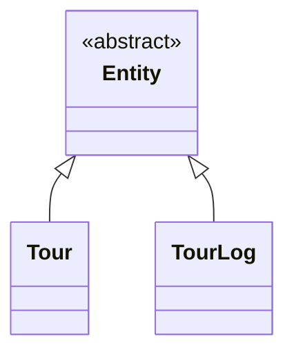
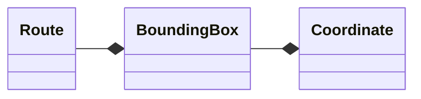
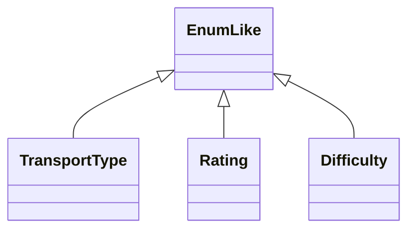
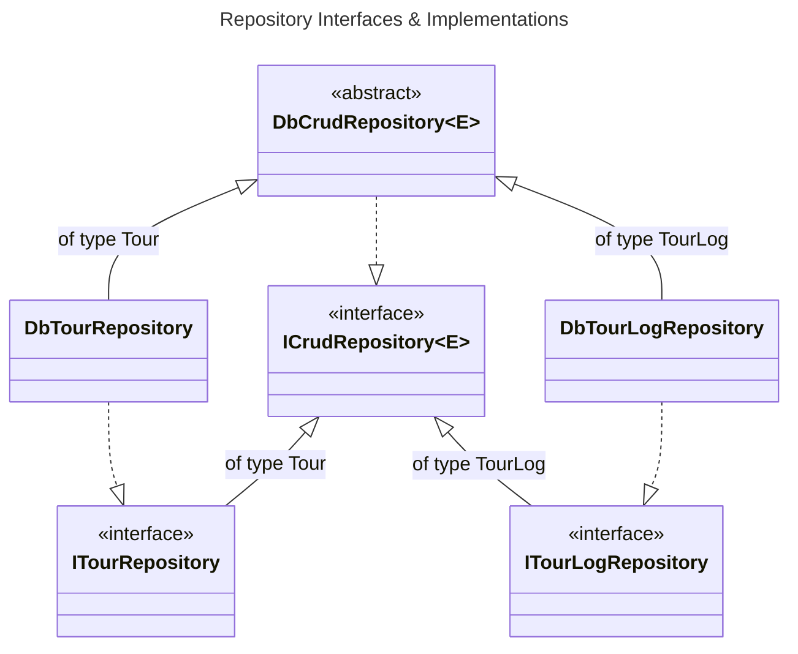
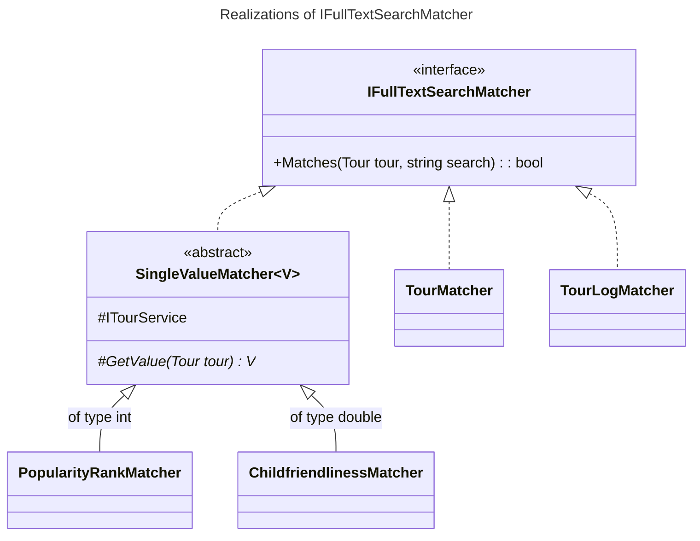
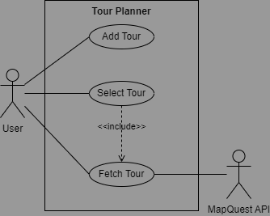
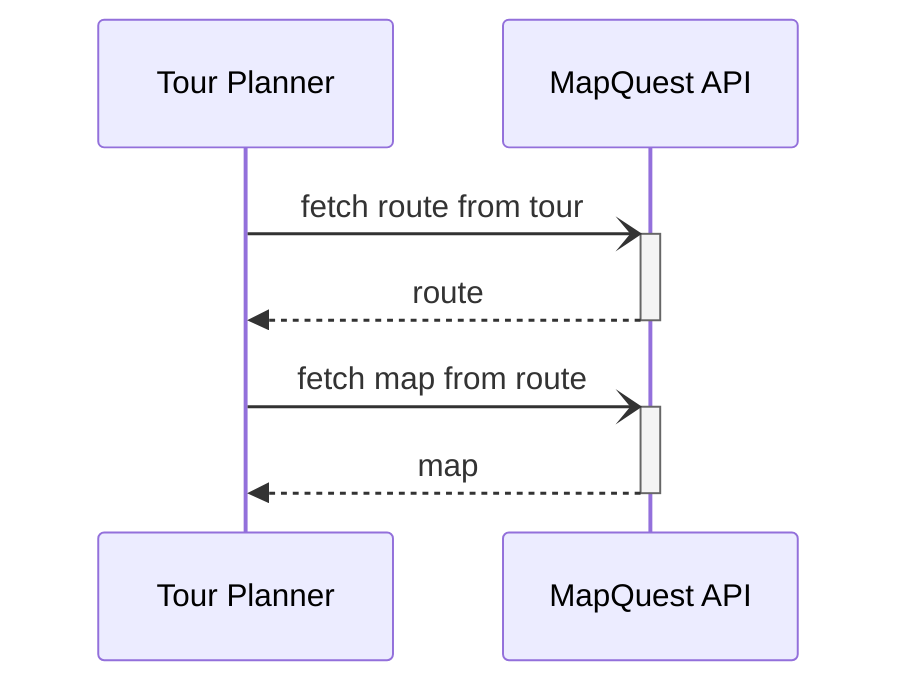
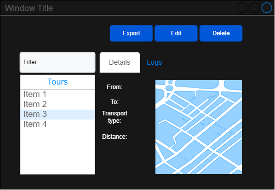

# tour-planner
C# WPF application for managing tours. Written by Nico Lerchl for Software Engineering 2 at FH Technikum Wien.

## Architecture
The general goal was to create a loosely coupled application, with a clear separation of concerns. This is achieved by using the principle of dependecy inversion through dependecy injection. Classes, wherever feasible, are only dependent on interfaces, not on concrete implementations. This allows for easy swapping of implementations.

### Logging
The logging abstraction is realized through Log4Net and a factory pattern. Info, Warn, Error, Fatal and Debug are the available log levels. Additionally, the project offers the `LogTimeSpent` attribute, to log how long a method took to execute. This is realized through a metalama `OverrideMethodApect`.

### Model
The model layer provides entities and models for the above layers. It is a very simple layer, only providing the bare minimum to be able to work with the data. It is also the only layer that is not dependent on any other layer.

#### Entities

#### Models

#### EnumLikes

### Data
The data layer provides the database context and repositories for the above layers. It is dependent on the model layer and the `Microsoft.EntityFrameworkCore` package.

### Logic
The logic layer is by far the biggest layer. Providing porting (export and import), reporting, full-text searching, validation and service to the above layers. It is dependent on the model and the data layer.

#### Porting
Ex- and importing uses the CSV format. All `Tour`s and `TourLog`s are exported to a single file. THe export contains all ids to keep the references between `Tour`s and `TourLog`s intact. MapQuest data and meta data is not exported and created once the tour is selected after import.

#### Full-text search
The full-text search uses realizations of the `IFullTextSearchMatcher`, there being four, as of now. Additionally, `SingleValueMatcher` provides another abstraction for Matchers that only match against a single value.

#### Service
The services are built up exactly like the repositories, with addition of the services for the MapQuest API.

#### WPF
The WPF layer is split into views and view models, splitting the logic and the UI. The views are dependent on the view models, but not the other way around. The view models are dependent on the logic, model and logging layer. This is also where the dependency injection is configured.

## Use Cases
Use case diagram for creating a tour, selecting a tour and fetching a tour:

And a sequence diagram for fetching a tour:

## UI / UX
For the UI I wanted to go for something modern, that might even look a little web based:

There is a list of all tours to the left, that can be filtered. The right part of the window contains a tab view with one tab being the tour's details and another its logs. Buttons are place at the top of the window in their representitive components. The buttons are disabled if the user is not allowed to use them.  
Adding or editing tours or tour logs opens a dialog.

## Libraries
Following libraries are used in this project:

- `Npgsql.EntityFrameworkCore.PostgreSQL`: ORM
- `Microsoft.Extensions.Configuration` and `Microsoft.Extensions.Configuration.Json`: External configuration
- `itext7`: PDF report generation
- `System.Drawing.Common`: Handling of map images
- `Extended.Wpf.Toolkit`: Date-Time-Picker
- `Microsoft.Extensions.DependencyInjection`: To realize dependency inversion
- `XamlAnimatedGif`: GIF support for the loading indicators
- `lo4net`: Logging
- `Metalama.Framework`: For the `LogTimeSepent` aspect
- `NUnit`: Unit testing
- `moq`: Mocking for unit testing

## Design Patterns

- `IoCContainerConfig` configures the creational pattern dependency injection.
- `LoggerFactory` uses the creational pattern factory method to create loggers.
- `IFullTextSearchMatcher` and its realizations use the behavioral pattern strategy for the full-text search.
- WPF comes with `ObservableCollection` which uses the behavioral pattern observer to notify the UI of changes. In addition to that, the view models use events to notify the UI of changes.
- Talking about WPF, the MVVM pattern is used to separate the UI from the logic.
- The view models also use the concurrency pattern event-based asynchronous for the UI not to freeze and notifying other view models of changes.

## Unique Feature
My unique feature consists of being able to refetch the route and thereby also map of a tour. To be able to use this effectively I have added two variables, last edited and last fetched, to a tour. The user can therefore, from the interval betweens those two timestamps decide, whether it is feasible to refetch the tour.

## Unit Testing
The following classes are covered by unit tests.

### CrudService
The `CrudService`, being the implementation of the `ICrudService` Interface is a key class, offering the basic CRUD operations from a `ICrudRepository` to the rest of the application. It is therefore important that the logic applied in this class does not mess up the data from the database but also protected against invalid input. Both of these scenarios are covered by the unit tests. For example: `TestGetAll` and `TestAddInvalid` perspectively.

### ValidationUtils
Ensuring the `CrudService` Unit Tests are valid requires that the `ValidationUtils`, used to validate entities, work as intended.

### EnumLikeConverter
The `EnumLikeConverter` is used to convert between an `EnumLike` and a the `EnumLike`'s value type. This is used to convert a `Tour`'s `TransportType`, `TourLog`'s `Rating` and `Difficulty` to write to or read from the database. This test therefore also takes into account the persistence.

### TimeConverter
Working with time is a finicky and error prone task. Ensuring that the `TimeConverter` works as intended is therefore important, also taking into account edge cases.

## Time Tracking
Development started on 22 February 2023 and mostly consisted of getting to know WPF and setting up the project structure. 29 March saw the introduction of the `PostgreContext` which started of development of the data project. Services and validation was added on 6 April with the frontend also making progress. From then on data and service abstraction were finished and the missing features, including their internal or external dependencies were added.

I have spent approximitely 120 hours on this project. Styling the application took up a fair bit, as I was completely knew to WPF, but I think it was worth it in the end.

## Lessons Learned
I was completely knew to WPF and the MVVM pattern and it was a lot of fun to learn about that, even though WPF is probably a bit dated by now. I knew dependency injection from Spring already but it was very interesting to see how it is done in C#. Building up applications loosely coupling pretty much everything was also a somewhat new and interesting experience. What I found most interesting in that regard is the abstraction away from OS and framework (WPF) dependencies.

## Git
[GitHub Repository](https://github.com/YusTheYokai/tour-planner)
